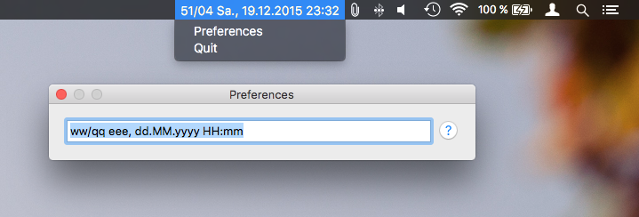

# Timestamp

A better macOS menu bar clock with a customizable date/time display and a calendar. Inspired by [Day-O](http://shauninman.com/archive/2011/10/20/day_o_mac_menu_bar_clock).

Built with [Electron](http://electron.atom.io/), [Moment.js](http://momentjs.com/) and [Pikaday](https://github.com/dbushell/Pikaday).

---
v1.0.0
